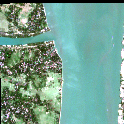
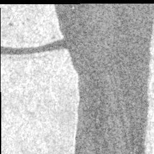
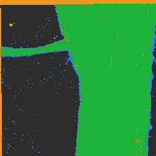
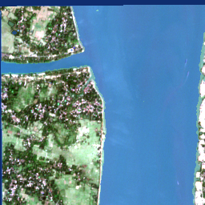

# Case Study: Mapping Water in the Sundarbans — with SatQuery AI

**A real place, real satellite data, real answers — end to end.**

## The scene

We gave SatQuery AI a pair of real satellite images of the **Hooghly river
estuary in the Sundarbans delta, West Bengal** (88.13°E, 22.31°N — one of the
world's largest river deltas, where flood and water monitoring genuinely
matter):

| Optical (Sentinel-2) | Radar (Sentinel-1 SAR) |
|---|---|
|  |  |

- **Left (optical):** what a normal camera-in-space sees — the wide river
  channel in blue-green, vegetated delta land around it.
- **Right (SAR):** a radar image — it sees through clouds and at night. Water
  shows up dark because calm water reflects radar away from the satellite.

## What we asked — and what happened

### 1. "Is there water in this scene?" (optical + SAR together, 11.8 seconds)

SatQuery ran **two independent specialists** and compared them:

- The **SAR tool** found water covering **54.7%** of the scene
- The **optical tool** found water covering **53.3%** of the scene
- Their masks agree at **IoU 0.89** — two different sensors, looking at physics
  from completely different angles, landed on almost the same map

*Agreement map: green = both sensors agree it's water — the river channel
traced exactly.*

The narrated answer — written by the AI voice, but only from verified evidence:

> *"Water is confirmed in this scene, with both SAR and optical tools detecting
> it… The two masks agree strongly, with an IoU of 0.892."*

*Water mask overlaid on the optical image — the overlay hugs the riverbank.*

### 2. "How big is the water body?" (optical alone, 22 seconds)

- **3.49 km²** — computed from real pixel size (each pixel = 10 m on the
  ground), not estimated by the language model
- 53.25% of the scene, concentrated in the north-east

Every image product was also exported as a **georeferenced GeoTIFF**
(`water_sar_mask.tif`, `water_optical_mask.tif`,
`agreement_map_live.tif`, `water_mask.tif`) — meaning the outputs drop straight
into professional GIS software (e.g., QGIS) correctly aligned to the real
world. This is what turns a demo into an analyst-grade artifact.

### 3. The honesty moment (why this demo is different)

Two things happened that most demos would hide:

- **Co-registration check:** the system verified the two images are aligned —
  their recorded ground positions match exactly (offset **0.0 m**). But the
  pixel-level texture check came back *"inconclusive (weak peak)"* — radar and
  camera textures don't always correlate. The system **reported both honestly**
  instead of silently claiming a perfect alignment.
- **Two model architecture, one disagreement:** we asked "how many boats are visible?"
  The **domain-adapted model** (trained by us on remote-sensing data) answered `1`. The **frozen narrator** (untouched base model) answered `0`. The system **disclosed both answers with their
  model identities** rather than silently picking one — every claim in the
  trace carries which model said it and the exact file hash of that model.

## What this demonstrates

| Capability | Shown here |
|---|---|
| Understands plain-English questions | All queries were natural language |
| Multi-sensor reasoning | Optical + radar cross-validated, not blended blindly |
| Real measurements | 3.49 km² from actual ground-sample distance |
| Auditable | Every number traces to a named tool/model + file hash |
| Honest under uncertainty | Withheld/caveated where evidence was weak |
| Analyst-grade output | Georeferenced GeoTIFFs, usable in QGIS directly |
| Runs offline | Both AI models ran locally on a laptop — zero internet |

## Files in this folder

- `optical.png` · `sar_vv.png` — the two input views
- `overlay_live.png` — detected water over the optical image
- `agreement_map_live.png` — where the two sensors agree/disagree
- `*.tif` — georeferenced export artifacts (EPSG:32645)
- `trace*.json` — the full execution records (every tool call, claim, hash)

---

## Appendix — the terms, in plain language

- **Optical image:** a photo from a satellite — like a camera in space.
- **SAR (Synthetic Aperture Radar):** an image made by bouncing radar pulses
  off the ground. Works through clouds and at night; water looks dark.
- **Backscatter (dB):** how strongly the ground bounces the radar back.
  Smooth water ≈ very low (dark).
- **IoU (Intersection over Union):** how much two outlines overlap, 0–1.
  0.89 here = the two sensors' water maps nearly coincide.
- **GSD (Ground Sample Distance):** real-world size of one pixel — 10 m here,
  which is what lets us say "3.49 km²" honestly.
- **GeoTIFF:** an image file that knows exactly where on Earth it belongs
  (coordinates embedded) — opens correctly in GIS software.
- **Evidence packet / provenance:** the machine-readable record of *which tool
  or model produced each claim*, including file fingerprints (SHA-256 hashes)
  so the exact software version is provable.
- **Withholding:** when evidence is too weak, the system says "insufficient
  evidence" instead of guessing — a designed behavior, not a failure.
- **Two model seats:** one adapted model trained by us on satellite benchmarks
  (the expert), one frozen general model (the neutral voice). Keeping them
  separate — and labeled — means the narrator can't silently drift from the
  evidence.
